# Containerized NextJS application on AWS

**Author**: Aleksandër Pulla  
**Date**: 10/05/2024

## Project Overview

In this project, we will containerize a Next.js default boilerplate application using Docker, push the Docker image to AWS ECR (Elastic Container Registry), and deploy it to AWS ECS (Elastic Container Service) with EC2 instances as the launch type. We will also configure an Application Load Balancer (ALB) to handle traffic distribution, and set up monitoring using CloudWatch.

### Prerequisites

- Basic knowledge of Docker and Next.js
- NodeJS, AWS CLI, Docker, and git installed
- AWS IAM user credentials with access to ECS, ECR, EC2, ELB, and CloudWatch services

---

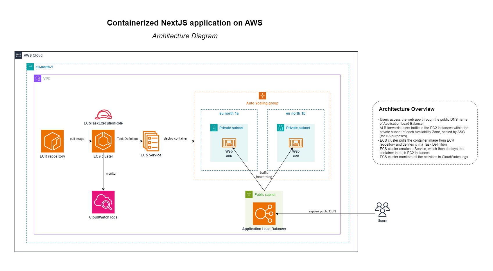

---

## 1. **Set up the Next.js Application and Dockerfile**

### Step 1.1: Generate a Next.js App

If you haven't already, create a Next.js boilerplate app by running:

```bash
npx create-next-app@latest nextjs-app
cd nextjs-app
```

### Step 1.2: Create a Dockerfile

In the root directory of the Next.js application (`nextjs-app`), create a `Dockerfile`:

```dockerfile
# Use an official Node.js image as the base
FROM node:18-alpine

# Set working directory inside the container
WORKDIR /app

# Copy package.json and package-lock.json to the working directory
COPY package*.json ./

# Install dependencies
RUN npm install

# Copy the rest of the application code
COPY . .

# Build the Next.js application
RUN npm run build

# Expose the port that the Next.js app will run on
EXPOSE 3000

# Start the application in production mode
CMD ["npm", "run", "start"]
```

This Dockerfile defines how to build the container for the Next.js app, including dependency installation and app building.


---

## 2. **Push the Docker Image to AWS ECR**

### Step 2.1: Create an ECR Repository

1. Go to the AWS ECR dashboard in the AWS Console.
2. Click **Create repository**.
3. Name the repository (e.g., `nextjs-app`), leave the rest as default, and click **Create**.

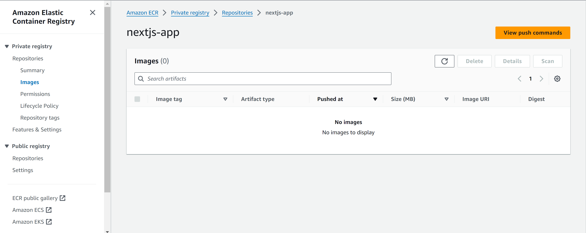

### Step 2.2: Build and push the Docker Image

1. Authenticate Docker to your AWS ECR registry:

```bash
aws ecr get-login-password --region <region> | docker login --username AWS --password-stdin <aws_account_id>.dkr.ecr.<region>.amazonaws.com
```


2. Build the Docker image from the `Dockerfile`:

```bash
docker build -t nextjs-app .
```

Verify that the image is successfully built:

```bash
docker image ls
```

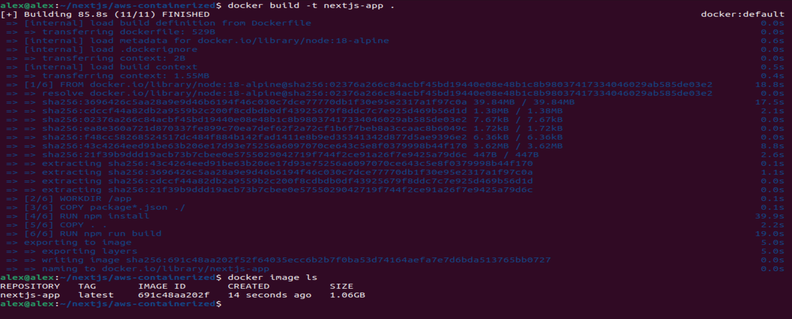

3. Tag the image with your ECR repository URI:

```bash
docker tag nextjs-app:latest <aws_account_id>.dkr.ecr.<region>.amazonaws.com/nextjs-app:latest
```


4. Push the image to ECR:

```bash
docker push <aws_account_id>.dkr.ecr.<region>.amazonaws.com/nextjs-app:latest
```


Once the process succeeds, you will notice that the image appears on the ECR Registry created earlier:

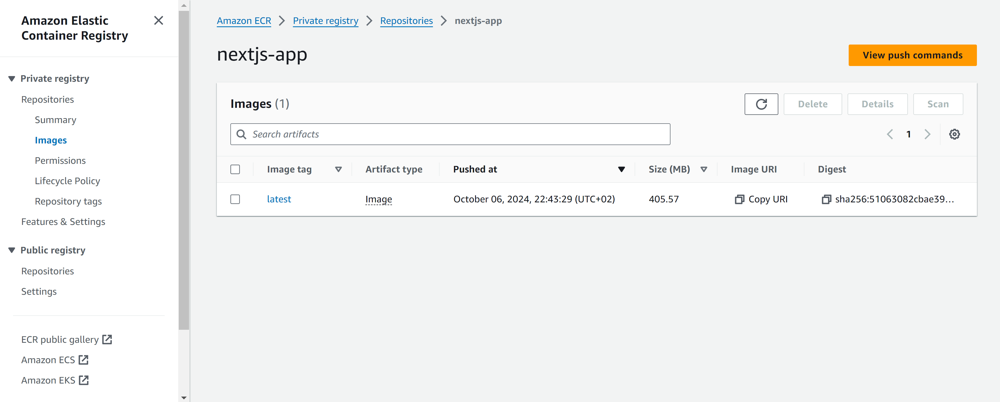

---

## 3. **Create an ECS Cluster and Task Definition**

### Step 3.1: Create an ECS Cluster

1. Navigate to the **ECS** dashboard.

2. Click on **Clusters** > **Create Cluster**.

3. Choose **EC2 Linux + Networking** as the cluster template.

4. Configure the cluster settings:

   - **Cluster name**: `nextjs-cluster`
   - **Instance type**: `t2.micro` or any other instance type
   - **Number of instances**: 2
   - **Networking**: Choose an existing VPC and subnets for the EC2 instances.

5. Click **Create** to finish setting up the cluster.

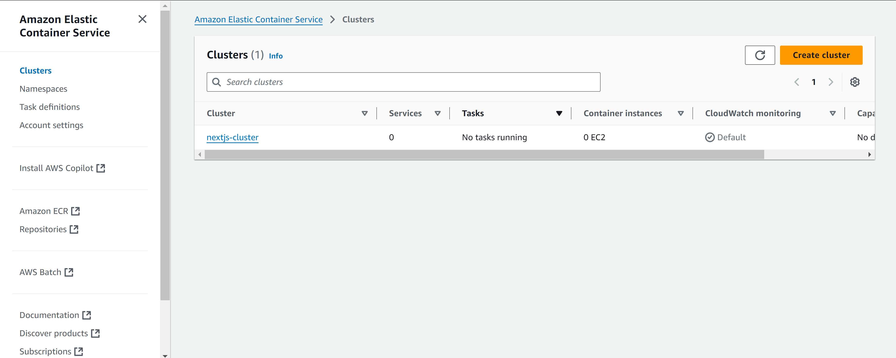

### Step 3.2: Create a Task Definition for ECS

1.  In the **ECS** dashboard, go to **Task Definitions**.
2.  Click **Create new Task Definition**.
3.  Select **EC2** as the launch type.
4.  Configure the task definition:

    - **Task definition name**: `nextjs-task`
    - **Container name**: `nextjs-app-container`
    - **Network mode**: bridge
    - **Image**: `<aws_account_id>.dkr.ecr.<region>.amazonaws.com/nextjs-app:latest`
    - **Memory**: 512 MiB
    - **CPU**: 1024 units (1 vCPU)
    - **Port mappings**: Set container port to `3000` (since Next.js runs on port 3000).

5.  Click **Create**.

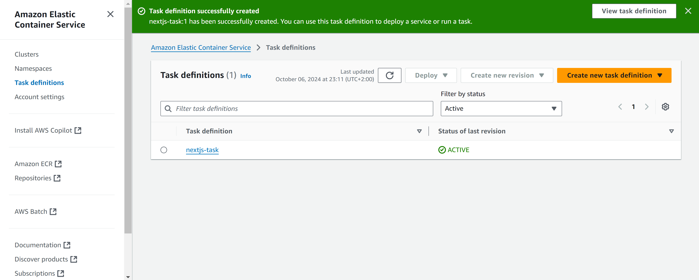

---

## 4. **Set up an Application Load Balancer (ALB)**

1. Go to **EC2** > **Load Balancers** and click **Create Load Balancer**.
2. Select **Application Load Balancer**.
3. Configure the load balancer:

   - **Name**: `nextjs-alb`
   - **Scheme**: Internet-facing
   - **Listener**: HTTP on port `80`
   - **VPC and subnets**: Select the same VPC and subnets as your ECS cluster.

4. Create a **Target Group** for the ECS service:

   - **Target type**: Instances
   - **Port**: 3000
   - **Protocol**: HTTP

5. Register your EC2 instances in the target group and complete the setup.

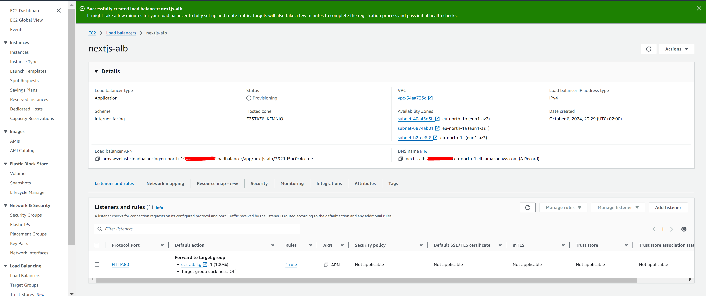

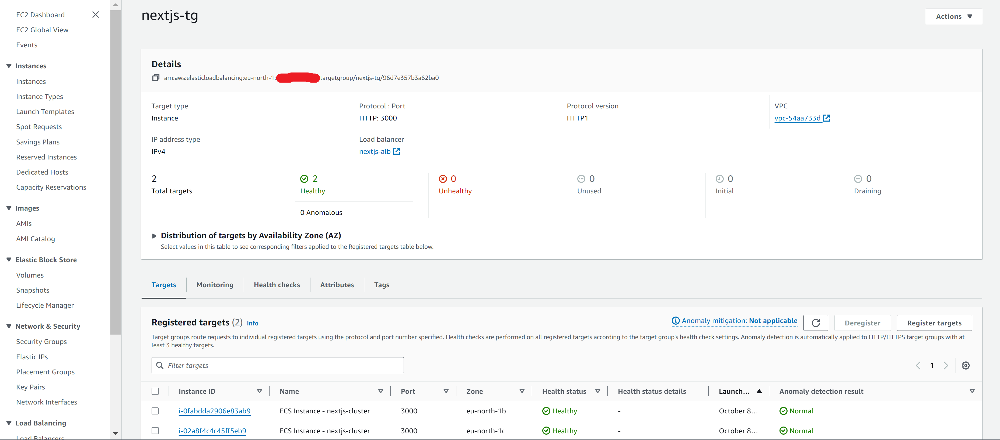

---

## 5. **Create an ECS Service**

1. In the **ECS** dashboard, go to your `nextjs-cluster` and click on **Services**.
2. Click **Create** and configure the service:

   - **Launch type**: EC2
   - **Task definition**: Select `nextjs-task`
   - **Service name**: `nextjs-service`
   - **Number of tasks**: 2
   - **Load balancer type**: Application Load Balancer (ALB)
   - **Target group**: Select the ALB target group you created earlier.

3. Adjust other settings like auto-scaling as needed and click **Create Service**.

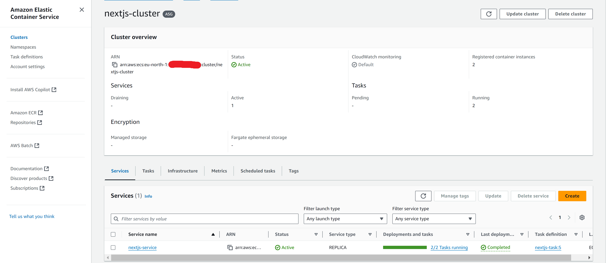

---

## 6. **Set up IAM Roles and Policies**

1.  Go to **IAM** > **Roles**.

2.  Create a new role with **ECS** as the trusted entity.

3.  Attach the following policies to the role:

    - **AmazonECSTaskExecutionRolePolicy**
    - **AmazonEC2ContainerRegistryReadOnly**

    Name the role `ecsTaskExecutionRole` and attach it to the **ECS task**.

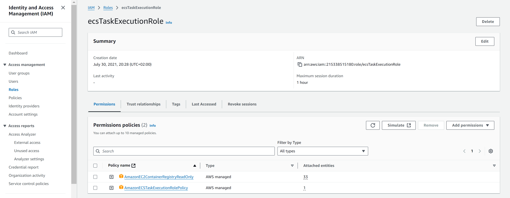

---

## 7. **Monitor and Log with CloudWatch**

1. In the ECS Task Definition, add logging configurations for CloudWatch:

```json
"logConfiguration": {
    "logDriver": "awslogs",
    "options": {
        "awslogs-group": "/ecs/nextjs-app",
        "awslogs-region": "<region>",
        "awslogs-stream-prefix": "ecs"
    }
}
```

2. Check CloudWatch logs in the CloudWatch console to view logs for your ECS tasks.

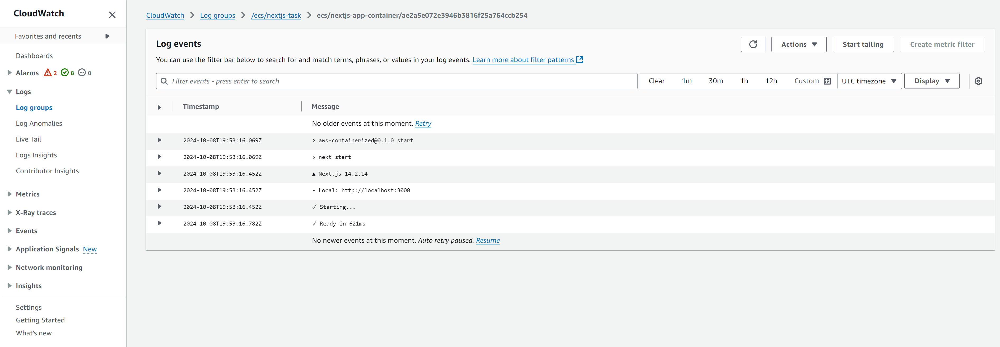

---

## 8. **Test the Next.js Application**

1. Open the **EC2 Load Balancers** section in AWS and find the DNS name of your Application Load Balancer.
2. Access the ALB's DNS name in your browser:

```http
http://<ALB-DNS-name>
```

You should see the Next.js default boilerplate page!


