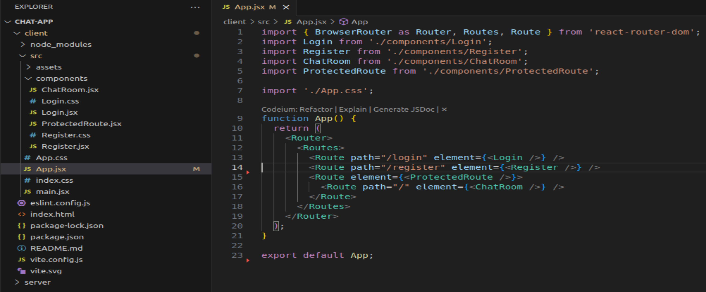
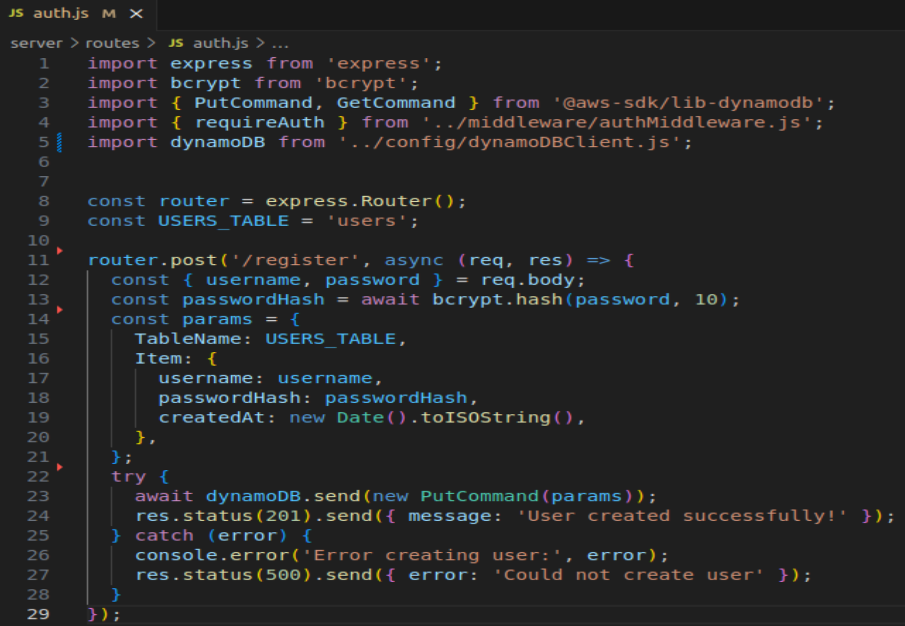
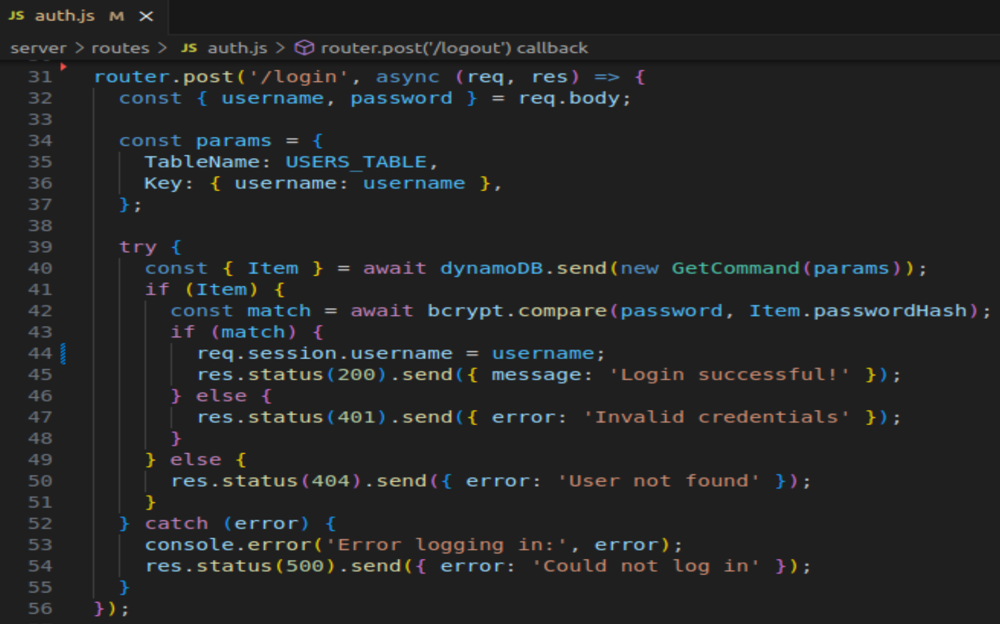
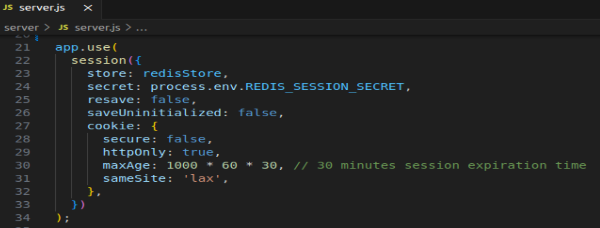
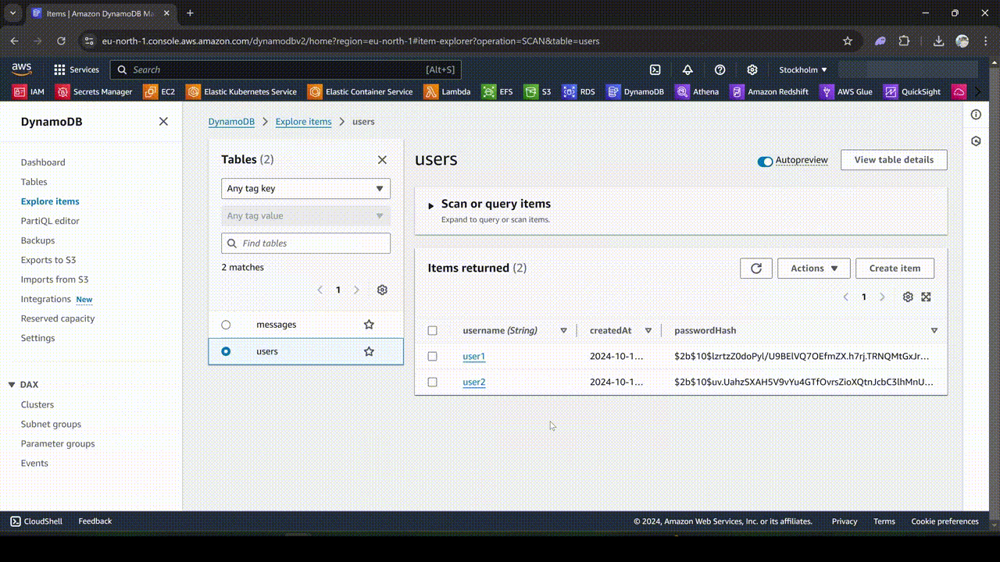

# **Real-Time Chat Application on AWS Serverless Architecture**

### **Overview**

This project is a **real-time chat application** built using **React (front-end)** and **Node.js (back-end)**. The application is designed to handle real-time messaging with **SocketIO** for WebSocket communication and session management with **Redis**. In the back-end, **DynamoDB** is used for storing user information and chat messages. In production, we plan to leverage **AWS Lambda**, **API Gateway**, and **ElastiCache (Redis)** for scaling the back-end services.
 

### Solution Architecture 

<!-- Remove the above title once the diagram is ready -->

<!-- TODO: Architecture Diagram -->

 

### **Front-End (React with Vite)**
The front-end uses **React** for building a responsive user interface, with **React Router** for routing between components like `Login`, `Register`, and `ChatRoom`. **Vite** is used as the build tool to streamline development and improve performance.

**Front-End Directory Structure (Client):**
- **src** folder includes:
  - **components** folder containing `Login.jsx`, `Register.jsx`, `ChatRoom.jsx`, and `ProtectedRoute.jsx`.
  - **App.jsx** manages routing, middleware for route protection, and the general structure of the application.
  

### **Back-End (Node.js with Express)**

The backend of this project is built using **Node.js** with **Express.js** to manage HTTP routes and handle API requests. For real-time messaging, **SocketIO** is integrated to provide WebSocket communication between users. 

During development, **Redis** is used locally for session management, which will be later replaced by **AWS ElastiCache (Redis)**. **DynamoDB** stores user credentials and chat messages. 

The backend structure is modular, with separate configuration files for different services and middleware.

**Back-end Directory Structure (Server):**
- **server** folder includes:
  - **config** folder, which contains the following files for configuring DynamoDB and Redis:
    - `dynamoDBClient.js` file, which provides a higher-level abstraction for handling JSON data, making it easier to interact with DynamoDB.
    
    - `redisClient.js` file configures the **Redis client** using the *redis* and *connect-redis* libraries. The code sets up a Redis client connection with host and port information sourced from environment variables. This configuration also includes a Redis store to manage session data.
    
  - **middleware** folder, containing `authMiddleware.js` file, which is responsible for protecting routes by ensuring that a user is authenticated. It checks for a valid session and verifies that a username exists in the session. If the session is valid, the request proceeds to the next middleware or route handler. If not, it responds with a `401 Unauthorized` status code and a JSON object indicating an error, along with a redirect path to the `/login` page.
  
  - **routes** folder, containing `auth.js` file, which is responsible for defining the Express routes for user authentication (register/login/logout functionalities).
  
  
  
  It utilizes `DynamoDB` for user data storage and `bcrypt` for password hashing and verification. Additionally, it imports the `requireAuth` middleware for protecting certain routes.
  
  - **sockets** folder, containing `socket.js` file, which is responsible for the real-time communication within the chat application using `Socket.IO`. It manages WebSocket connections, handles events related to user actions, and interacts with DynamoDB to store and retrieve chat messages.
  
  - **server.js** file, which is the entry point for the Node.js back-end application. It accomplishes the following operations:
    - sets up the Express server;
      
    - configures middleware for session management and CORS;
      
    - initializes SocketIO for real-time communication;
      
    - sets up Redis for session storage;
      
    - handles authentication routes.
      

  - **.env** file, which is responsible for storing environment variables that are essential for configuring the backend application securely and efficiently. 
  

 

### Demo

This section consists of several scenarios, demonstrating the user experience of the application while implementing all the project's requirements.

**Scenario #1: User Login & Session Persistence in Redis**

In this scenario, a user logs into the chat application using their credentials. Upon successful authentication, a session is created and stored in Redis. This session includes user details and an expiration time to manage user activity. The application checks Redis for the session on each request to maintain the logged-in state. If the session is found, the user remains logged in, ensuring a seamless experience.

**Scenario #2: Real-Time Data Streaming & Ingestion from Amazon DynamoDB**

In this scenario, data is firstly added in an Amazon DynamoDB table, triggering a real-time ingestion pipeline. The processed data is then ingested back to the chat via SocketIO in real-time, thus enabling a smooth conversation between the users.

**Scenario #3: User Logout expires session in Redis**

In this scenario, when a user initiates a logout, the application explicitly removes the user's session from Redis. This ensures that any further requests by the user will require re-authentication. 

**Scenario #4: Session expiration in Redis logs out the user**

In this scenario, a session stored in Redis naturally expires after its set time-to-live (TTL) period. When the user makes a request after the session has expired, the application detects the absence of the session in Redis and treats the user as logged out. This results in the user redirection to the login page, ensuring user authentication remains up to date.

NOTE: As my session's TTL is set to 30 minutes, for the demo purposes I have simulated the session expiration process by flushing out the database of Redis.

 

### "Flying to the cloud with serverless wings"

<!-- TODO: Migration to AWS cloud -->

