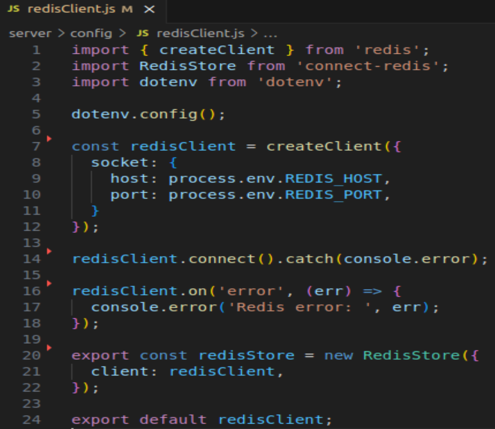
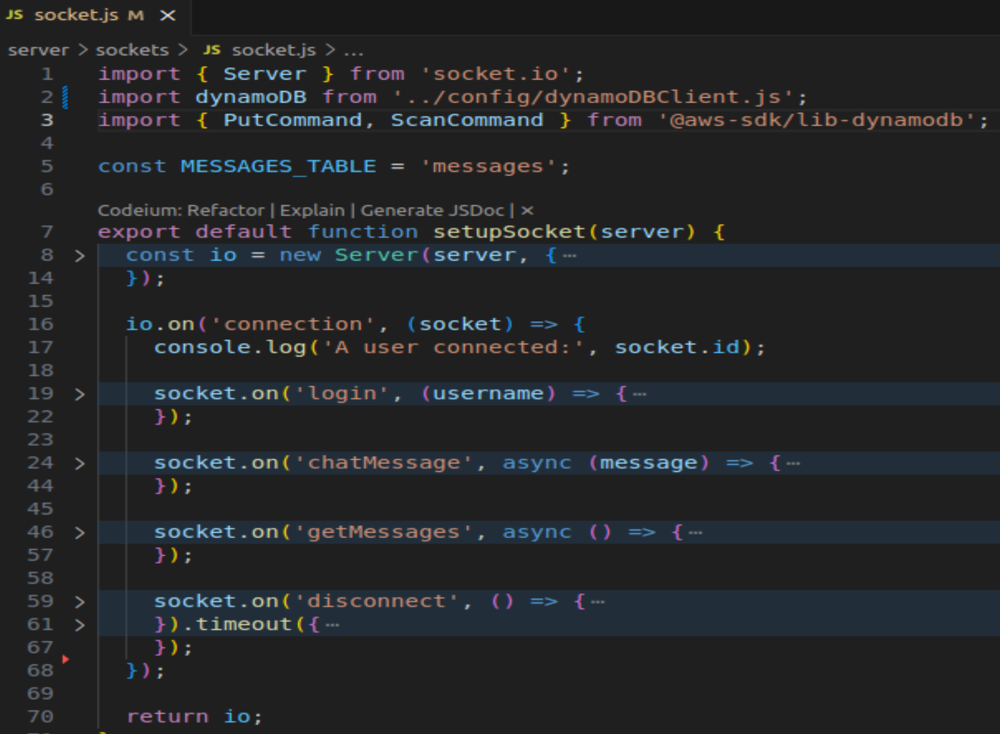
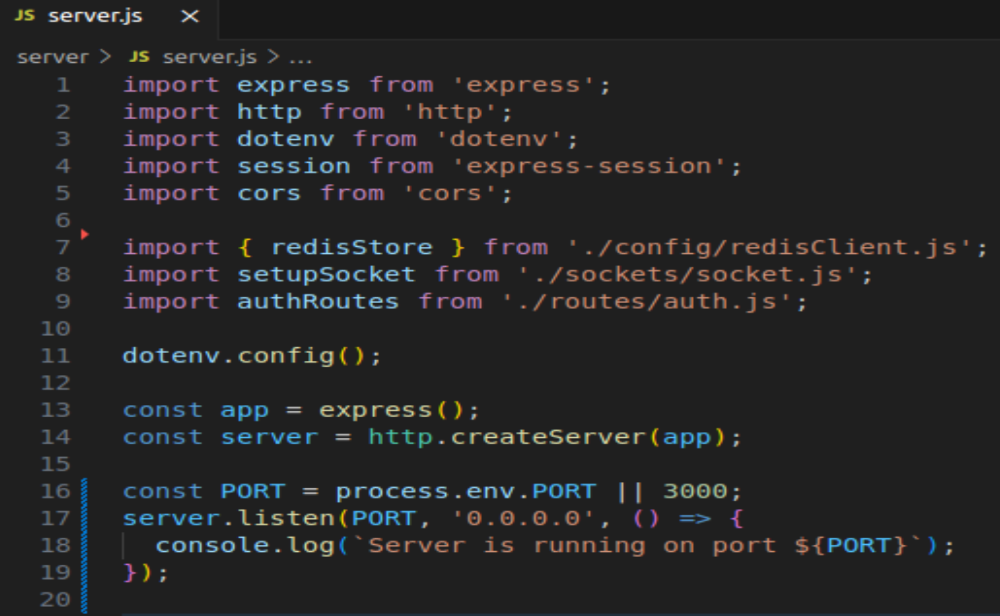

# **Real-Time Chat Application on AWS Serverless Architecture**

## **Overview**

This project is a **real-time chat application** built using **React (front-end)** and **Node.js (back-end)**. The application is designed to handle real-time messaging with **Socket.IO** for WebSocket communication and **session management** with **Redis**. In the back-end, **DynamoDB** is used for storing user information and chat messages. In production, we plan to leverage **AWS Lambda**, **API Gateway**, and **ElastiCache Redis** for scaling the back-end services.

### **Front-end (React with Vite)**
The front-end uses **React** for building a responsive user interface, with **React Router** for routing between components like **Login**, **Register**, and **ChatRoom**. **Vite** is used as the build tool to streamline development and improve performance.

<!-- TODO: Architecture Diagram -->

**Front-end Directory Structure (Client):**
- **src** folder includes:
  - **components** folder containing `Login.jsx`, `Register.jsx`, `ChatRoom.jsx`, and `ProtectedRoute.jsx`.
  - **App.jsx** manages routing, middleware for route protection, and the general structure of the application.
  

### **Back-end (Node.js with Express)**

The backend of this project is built using **Node.js** with **Express.js** to manage HTTP routes and handle API requests. For real-time messaging, **Socket.IO** is integrated to provide WebSocket communication between users. 

During development, **Redis** is used locally for session management, which will be later replaced by **AWS ElastiCache Redis**. **DynamoDB** stores user credentials and chat messages. 

The backend structure is modular, with separate configuration files for different services and middleware.

**Back-end Directory Structure (Server):**
- **server** folder includes:
  - **config** folder, which contains the following files for configuring DynamoDB and Redis:
    - `dynamoDBClient.js` file, which provides a higher-level abstraction for handling JSON data, making it easier to interact with DynamoDB.
    
    - `redisClient.js` file configures the **Redis client** using the *redis* and *connect-redis* libraries. The code sets up a Redis client connection with host and port information sourced from environment variables. This configuration also includes a Redis store to manage session data.
    
  - **middleware** folder, containing `authMiddleware.js` file, which is responsible for protecting routes by ensuring that a user is authenticated. It checks for a valid session and verifies that a username exists in the session. If the session is valid, the request proceeds to the next middleware or route handler. If not, it responds with a `401 Unauthorized` status code and a JSON object indicating an error, along with a redirect path to the `/login` page.
  
  - **routes** folder, containing `auth.js` file, which is responsible for defining the Express routes for user authentication (register/login/logout functionalities).
  
  
  
  It utilizes `DynamoDB` for user data storage and `bcrypt` for password hashing and verification. Additionally, it imports the `requireAuth` middleware for protecting certain routes.
  
  - **sockets** folder, containing `socket.js` file, which is responsible for the real-time communication within the chat application using `Socket.IO`. It manages WebSocket connections, handles events related to user actions, and interacts with DynamoDB to store and retrieve chat messages.
  
  - **server.js** file, which is the entry point for the Node.js back-end application. It accomplishes the following operations:
    - sets up the Express server;
      
    - configures middleware for session management and CORS;
      
    - initializes SocketIO for real-time communication;
      
    - sets up Redis for session storage;
      
    - handles authentication routes.
      

  - **.env** file, which is responsible for storing environment variables that are essential for configuring the backend application securely and efficiently. 
  